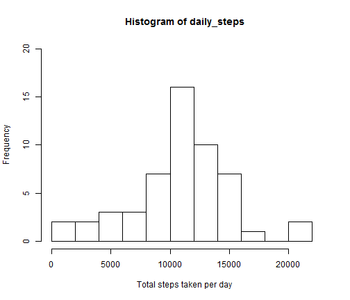
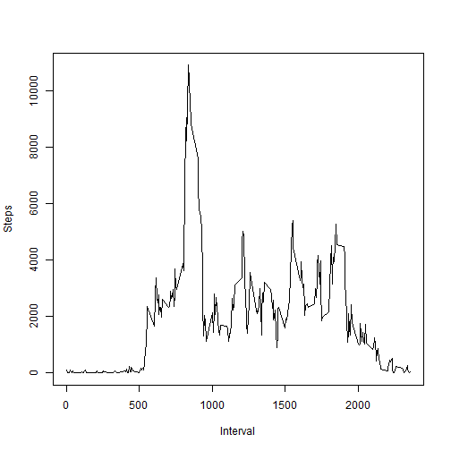
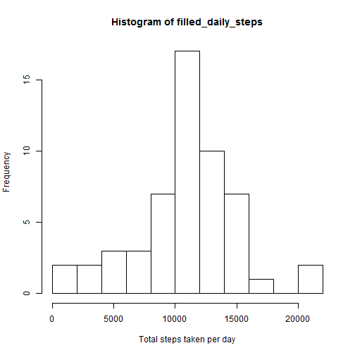
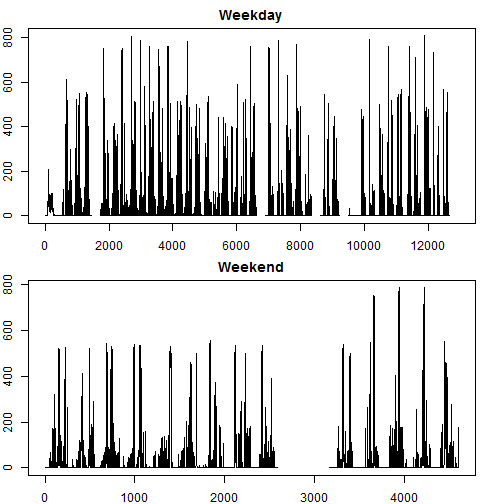

## Loading and preprocessing the data

1. When the working directory is set as the one containing the source folder,
the data can be loaded:


```r
activity_data_set <- read.csv(unz('activity.zip','activity.csv'))
```

2. The rows containing missing values are removed:


```r
clean_data_set <- activity_data_set[complete.cases(activity_data_set),]
```

## What is mean total number of steps taken per day?

The total number of steps taken per day are calculated as follows:


```r
daily_steps <- tapply(clean_data_set$steps,FUN=sum,INDEX=clean_data_set$date)
```

1. A histogram is plotted and the mean and median of the total number of steps taken per day is calculated:


```r
hist(daily_steps, breaks=10, xlab="Total steps taken per day", ylab="Frequency",xlim=c(0,22500),ylim=c(0,20))
```

 


2.

```r
daily_mean <- mean(daily_steps, na.rm=T)
daily_median <- median(daily_steps, na.rm=T)
daily_mean
```

```
## [1] 10766.19
```

```r
daily_median
```

```
## [1] 10765
```
The mean is 1.0766189 &times; 10<sup>4</sup> and the median is 10765.


## What is the average daily activity pattern?

For each interval, the number of steps are summed over all the days:


```r
interval_steps <- tapply(clean_data_set$steps,FUN=sum,INDEX=clean_data_set$interval,na.rm=T)
```

1. This results in the time series plot of the average daily activity pattern:


```r
plot(x=clean_data_set$interval[0:288],y=interval_steps, type="l", xlab="Interval", ylab="Steps")
```

 

2. The interval with the maximum number of steps is determined as follows:


```r
maximum_steps <- max(interval_steps)
index <- which(interval_steps %in% maximum_steps)
interval_of_index <- clean_data_set$interval[index]
maximum_steps
```

```
## [1] 10927
```

```r
interval_of_index
```

```
## [1] 835
```

Interval 835 contains a maximum of 10927 steps.

## Imputing missing values

1. The number of rows containing missing values are calculated using the complete.cases function. Since this function reports on whether a value is missing (or not), we are looking for the number of "FALSE" counts in the dataset.

```r
boolean_na <- complete.cases(activity_data_set)
count <- table(boolean_na)
count
```

```
## boolean_na
## FALSE  TRUE 
##  2304 15264
```
Therefore, the activity dataset contains 2304 missing values.

2 and 3. To fill the missing values, the strategy chosen is to replace each missing value with
the mean number of steps for that interval.

Make a copy of the activity dataset:

```r
filled_dataset <- activity_data_set
```

Create a vector containing the mean number of steps taken during each interval.
Create a data frame containing the interval values and the corresponding mean values.
This data frame will be used to fill in missing values.


```r
interval_steps_mean <- tapply(clean_data_set$steps,FUN=mean,INDEX=clean_data_set$interval,na.rm=F)
interval <- as.numeric(levels(factor(activity_data_set$interval)))
df <- data.frame(interval, interval_steps_mean)
```


Using a for loop, iterate through all the rows in the copied dataset. If a row's 
"step" value is missing:
- get the corresponding interval
- get the calculated mean for that interval
- replace the missing value with the mean value identified


```r
for(i in 1:nrow(filled_dataset)){
        if(is.na(filled_dataset$steps[i])){
                this_interval <- filled_dataset$interval[i]
                index_na_value <- which(this_interval %in% df$interval)
                fill_value <- df$interval_steps_mean[i]
                filled_dataset$steps[i] <- fill_value
        }
}
```

"filled_dataset" is now the new dataset that is equal to the original dataset but with missing values filled in.

4. Now we can plot the histogram using the filled dataset.

First we need to calculate the total number of steps taken per day for the filled dataset:


```r
filled_daily_steps <- tapply(filled_dataset$steps,FUN=sum,INDEX=filled_dataset$date)
```

Now we can plot the histogram:


```r
hist(filled_daily_steps, breaks=10, xlab="Total steps taken per day", ylab="Frequency")
```

 

The mean and the median is calculated in the same way:


```r
filled_mean <- mean(filled_daily_steps, na.rm=T)
filled_median <- median(filled_daily_steps, na.rm=T)
filled_mean
```

```
## [1] 10766.19
```

```r
filled_median
```

```
## [1] 10765.59
```

The mean is 1.0766189 &times; 10<sup>4</sup> and the median is 1.0765594 &times; 10<sup>4</sup>, which is no different from the mean and median 
calculated with removed missing values.

## Are there differences in activity patterns between weekdays and weekends?

1. First create a new column containing the day corresponding to each date, then append this new 
column to the filled_dataset:

```r
weekday_column <- c()
for(i in 1:nrow(filled_dataset)){
        date <- as.character(filled_dataset$date[i])
        day <- weekdays(as.POSIXct(date))
        weekday_column <- c(weekday_column, day)
}
filled_plus_day <- as.data.frame(cbind(filled_dataset,weekday_column))
```

Now we have to determine whether the day of the week is a weekday, or
falls on the weekend. Each day is classified as either "weekday" or "weekend", and a new column is appended to the dataset:


```r
weekday_or_end <- c()
for(i in 1: nrow(filled_plus_day)){
        #i=1500
        if(filled_plus_day$weekday_column[i] == "Saturday" || filled_plus_day$weekday_column[i] == "Sunday"){
                weekday_or_end <- c(weekday_or_end, "weekend")
        } else
                weekday_or_end <- c(weekday_or_end, "weekday")
}

filled_plus_day_plus_type <- cbind(filled_plus_day, weekday_or_end)
```

To make the panel plot, we first need to split the data according to the weekdays and weekends:


```r
week_end_or_day <- split(x=filled_plus_day_plus_type, f=filled_plus_day_plus_type$weekday_or_end)
number_weekdays <- nrow(week_end_or_day$weekday)
number_weekends <- nrow(week_end_or_day$weekend)
```

There are 12960 weekdays in the dataset and 4608 in the dataset.

2. Now, the panel plot can be generated:


```r
par(mfrow=c(2,1), mar=rep(2,4))
plot(x=1:number_weekdays,y=week_end_or_day$weekday[,1], type="l", main="Weekday", ylab="Steps")
plot(x=1:number_weekends,y=week_end_or_day$weekend[,1], type="l", main="Weekend", ylab="Steps")
```

 
